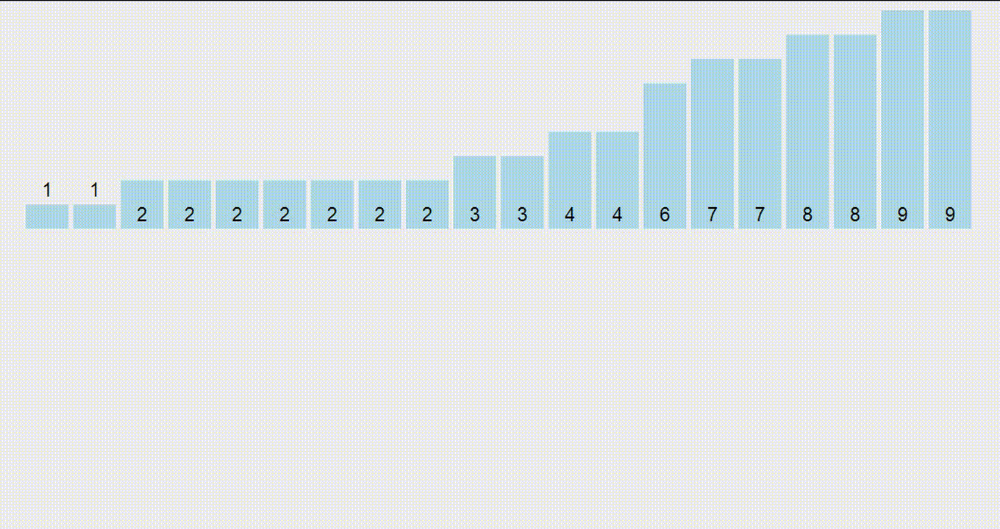

```
      Сортировка подсчетом – один из базовых алгоритмов, служит основой для многих сортировок, но
    сам используется только для ознакомления с темой. Его суть в том, чтобы подсчитать сколько раз
    число встречается в массиве, а затем заполнить массив этими числами в соответствии с количеством.
```


