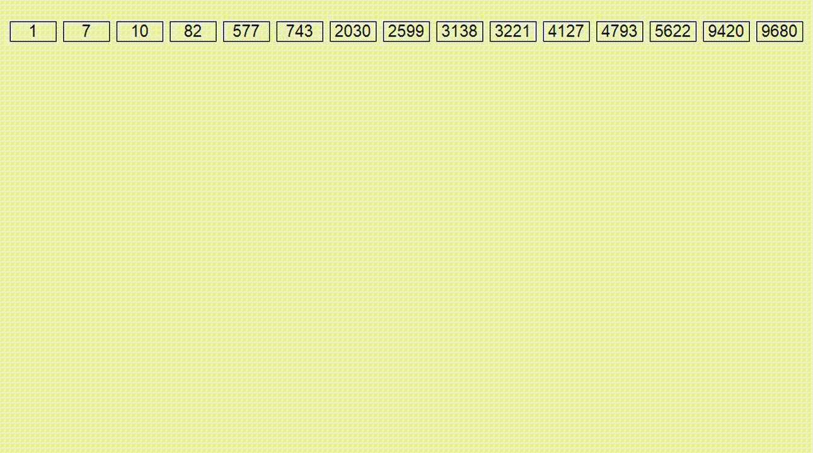

```
    Поразрядная сортировка
    O(wn), где n - количество элементов, w - количество разрядов(длина строк например).
    
    Поразрядная сортировка — сортировка по разрядам. 
    Существует две разновидности: LSD (least significant digit) и MSD (least significant digit).
    В первом случае происходит сортировка элементов по младшим разрядам (все оканчивающиеся на 0,
    затем на 1 и так до 9). После этого они группируются по следующему с конца разряду, пока они
    не закончатся. В MSD сортировка происходит по старшему разряду.
```


