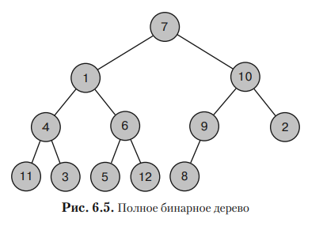

```
      Бинарное дерево — это дерево, в котором каждая вершина соединена с хотя бы двумя дочерними
    записями.
    
      Если все его уровни заполнены, кроме, возможно, последнего (где все вершины сдвинуты влево),
    то такое дерево называется полным.
```


