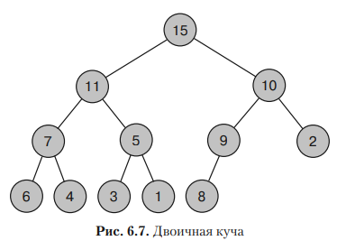

```
      Двоичная куча — это полное бинарное дерево, где каждая вершина содержит значение, которое не
    меньше тех, что находятся в его дочерних записях. 
    
      Кучи хороши для создания очередей с приоритетом, поскольку чем больше элемент в дереве, тем
    ближе он к корневому узлу. 
```


